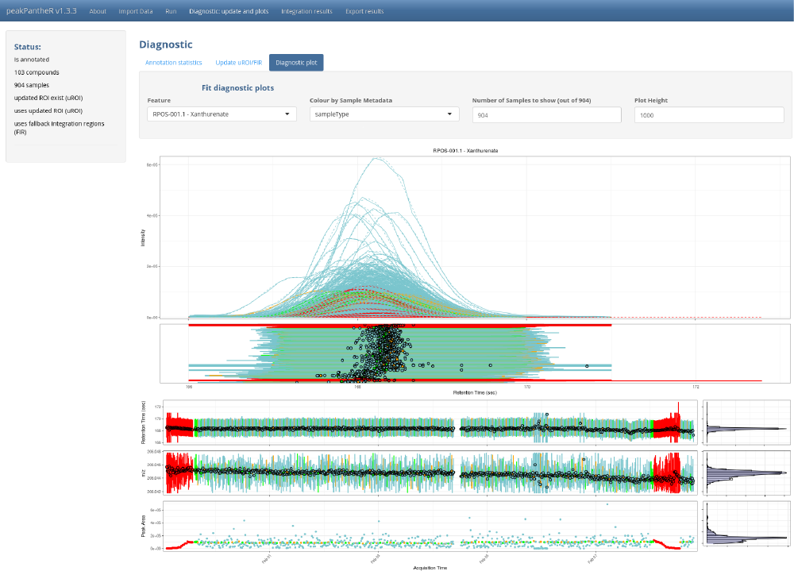

```{r biocstyle, echo = FALSE, results = "asis" }
BiocStyle::markdown()
```
```{r, echo = FALSE}
knitr::opts_chunk$set(
    collapse = TRUE,
    comment = "#>"
)
```

**Package**: `r Biocpkg("peakPantheR")`<br />
**Authors**: Arnaud Wolfer<br />

```{r init, message = FALSE, echo = FALSE, results = "hide" }
## Silently loading all packages
library(BiocStyle)
library(peakPantheR)
library(faahKO)
library(pander)
```


Package for _Peak Picking and ANnoTation of High resolution Experiments in R_,
implemented in `R` and `Shiny`


# Overview

`peakPantheR` implements functions to detect, integrate and report pre-defined
features in MS files (_e.g. compounds, fragments, adducts, ..._).

It is designed for:

* **Real time** feature detection and integration (see
[Real Time Annotation](real-time-annotation.html))
    + process `multiple` compounds in `one` file at a time
* **Post-acquisition** feature detection, integration and reporting (see 
[Parallel Annotation](parallel-annotation.html))
    + process `multiple` compounds in `multiple` files in `parallel`, store 
    results in a `single` object

`peakPantheR` can process LC/MS data files in _NetCDF_, _mzML_/_mzXML_ and 
_mzData_ format as data import is achieved using Bioconductor's 
`r Biocpkg("mzR")` package. 

# Installation

To install `peakPantheR` from Bioconductor:
```{r, eval = FALSE}
if (!requireNamespace("BiocManager", quietly = TRUE))
    install.packages("BiocManager")

BiocManager::install("peakPantheR")
```

Install the development version of `peakPantheR` directly from GitHub with:
```{r, eval = FALSE}
# Install devtools
if(!require("devtools")) install.packages("devtools")
devtools::install_github("phenomecentre/peakPantheR")
```


## Getting Started

To get started `peakPantheR`'s graphical user interface implements all the functions to detect and integrate **multiple** compounds in **multiple** files in **parallel** and store results in a **single** object. It can be employed to integrate a large number of expected
features across a dataset:
```{r, eval = FALSE}
library(peakPantheR)

peakPantheR_start_GUI(browser = TRUE)
#  To exit press ESC in the command line
```
```{r, fig.align="center", out.width = "700px", echo = FALSE}

```

The GUI is to be preferred to understand the methodology, select the best parameters on a subset of the samples before running the command line, or to visually explore results.

If a very high number of samples and features is to be processed, `peakpantheR`'s command line functions are more efficient, as they can be integrated in scripts and the reporting automated.


# Input Data

Both real time and parallel compound integration require a common set of 
information:

* Path(s) to `netCDF` / `mzML` MS file(s)
* An expected region of interest (`RT` / `m/z` window) for each compound.


## MS files

For demonstration purpose we can annotate a set a set of raw MS spectra (in 
_NetCDF_ format) provided by the `r Biocpkg("faahKO")` package. Briefly, this 
subset of the data from [@Saghatelian04] invesigate the metabolic consequences 
of knocking out the fatty acid amide hydrolase (FAAH) gene in mice. The dataset 
consists of samples from the spinal cords of 6 knock-out and 6 wild-type mice. 
Each file contains data in centroid mode acquired in positive ion mode form 
200-600 m/z and 2500-4500 seconds.

Below we install the `r Biocpkg("faahKO")` package and locate raw CDF files of 
interest:
```{r, eval = FALSE}
if (!requireNamespace("BiocManager", quietly = TRUE))
    install.packages("BiocManager")

BiocManager::install("faahKO")
```
```{r}
library(faahKO)
## file paths
input_spectraPaths  <- c(system.file('cdf/KO/ko15.CDF', package = "faahKO"),
                        system.file('cdf/KO/ko16.CDF', package = "faahKO"),
                        system.file('cdf/KO/ko18.CDF', package = "faahKO"))
input_spectraPaths
```

## Expected regions of interest

Expected regions of interest (targeted features) are specified using the 
following information:

* `cpdID` (numeric)
* `cpdName` (character)
* `rtMin` (sec)
* `rtMax` (sec)
* `rt` (sec, optional / `NA`)
* `mzMin` (m/z)
* `mzMax` (m/z)
* `mz` (m/z, optional / `NA`)

Below we define 2 features of interest that are present in the 
`r Biocpkg("faahKO")` dataset and can be employed in subsequent vignettes:
```{r, eval=FALSE}
# targetFeatTable
input_targetFeatTable <- data.frame(matrix(vector(), 2, 8, dimnames=list(c(), 
                        c("cpdID", "cpdName", "rtMin", "rt", "rtMax", "mzMin", 
                        "mz", "mzMax"))), stringsAsFactors=FALSE)
input_targetFeatTable[1,] <- c(1, "Cpd 1", 3310., 3344.888, 3390., 522.194778, 
                                522.2, 522.205222)
input_targetFeatTable[2,] <- c(2, "Cpd 2", 3280., 3385.577, 3440., 496.195038,
                                496.2, 496.204962)
input_targetFeatTable[,c(1,3:8)] <- sapply(input_targetFeatTable[,c(1,3:8)], 
                                            as.numeric)
```
```{r, results = "asis", echo = FALSE}
# use pandoc for improved readability
input_targetFeatTable <- data.frame(matrix(vector(), 2, 8, dimnames=list(c(), 
                        c("cpdID", "cpdName", "rtMin", "rt", "rtMax", "mzMin", 
                        "mz", "mzMax"))), stringsAsFactors=FALSE)
input_targetFeatTable[1,] <- c(1, "Cpd 1", 3310., 3344.888, 3390., 522.194778, 
                                522.2, 522.205222)
input_targetFeatTable[2,] <- c(2, "Cpd 2", 3280., 3385.577, 3440., 496.195038,
                                496.2, 496.204962)
input_targetFeatTable[,c(1,3:8)] <- sapply(input_targetFeatTable[,c(1,3:8)], 
                                            as.numeric)
rownames(input_targetFeatTable) <- NULL
pander::pandoc.table(input_targetFeatTable, digits = 9)
```

# Preparing input for the graphical user interface

While the command line functions accept Data.Frame and vectors as input, the graphical user interface (GUI) will read the same information from a set of `.csv` files, or an already set-up `peakPantheRAnnotation` object in `.RData` format.

We can now generate GUI input files for the `r Biocpkg("faahKO")` example dataset presented previously:

## _peakPantheRAnnotation_ .RData

A `peakPantheRAnnotation` (previously annotated or not) can be passed as input in a `.RData` file. The `peakPantheRAnnotation` object must be named _annotationObject_:

```{r, eval=FALSE}
library(faahKO)

# Define the file paths (3 samples)
input_spectraPaths  <- c(system.file('cdf/KO/ko15.CDF', package = "faahKO"),
                        system.file('cdf/KO/ko16.CDF', package = "faahKO"),
                        system.file('cdf/KO/ko18.CDF', package = "faahKO"))

# Define the targeted features (2 features)
input_targetFeatTable <- data.frame(matrix(vector(), 2, 8, dimnames=list(c(),
                        c("cpdID", "cpdName", "rtMin", "rt", "rtMax", "mzMin",
                        "mz", "mzMax"))), stringsAsFactors=FALSE)
input_targetFeatTable[1,] <- c("ID-1", "Cpd 1", 3310., 3344.888, 3390., 522.194778,
                                522.2, 522.205222)
input_targetFeatTable[2,] <- c("ID-1", "Cpd 2", 3280., 3385.577, 3440., 496.195038,
                                496.2, 496.204962)
input_targetFeatTable[,3:8] <- sapply(input_targetFeatTable[,3:8], as.numeric)

# Define some random compound and spectra metadata
# cpdMetadata
input_cpdMetadata     <- data.frame(matrix(data=c('a','b',1,2), nrow=2, ncol=2, dimnames=list(c(),c('testcol1','testcol2')), byrow=FALSE), stringsAsFactors=FALSE)
# spectraMetadata
input_spectraMetadata <- data.frame(matrix(data=c('c','d','e',3,4,5), nrow=3, ncol=2, dimnames=list(c(),c('testcol1','testcol2')), byrow=FALSE), stringsAsFactors=FALSE)

# Initialise a simple peakPantheRAnnotation object [3 files, 2 features, no uROI, no FIR]
initAnnotation      <- peakPantheRAnnotation(spectraPaths=input_spectraPaths,
                                             targetFeatTable=input_targetFeatTable,
                                             cpdMetadata=input_cpdMetadata,
                                             spectraMetadata=input_spectraMetadata)

# Rename and save the annotation to disk
annotationObject <- initAnnotation
save(annotationObject, file = './example_annotation_ppR_UI.RData', compress=TRUE)

```

## CSV file input

Another input option for the GUI input consists of a set of `.csv` files.

### Targeted features
Targeted features are defined in a `.csv` with as rows each feature to target (the first row must be the column name), and as columns the fit parameters to use. At minimum the following parameters must be defined:

`cpdID`, `cpdName`, `rtMin`, `rt`, `rtMax`, `mzMin`, `mz`, `mzMax`

If `uROI` and `FIR` are to be set, the following columns must be provided:

`cpdID`, `cpdName`, `ROI_rt`, `ROI_mz`, `ROI_rtMin`, `ROI_rtMax`, `ROI_mzMin`, `ROI_mzMax`, `uROI_rtMin`, `uROI_rtMax`, `uROI_mzMin`, `uROI_mzMax`, `uROI_rt`, `uROI_mz`, `FIR_rtMin`, `FIR_rtMax`, `FIR_mzMin`, `FIR_mzMax`

```{r, eval=FALSE}
# Define targeted features without uROI and FIR (2 features)
input_targetFeatTable <- data.frame(matrix(vector(), 2, 8, dimnames=list(c(),
                        c("cpdID", "cpdName", "rtMin", "rt", "rtMax", "mzMin",
                        "mz", "mzMax"))), stringsAsFactors=FALSE)
input_targetFeatTable[1,] <- c("ID-1", "Cpd 1", 3310., 3344.888, 3390., 522.194778,
                                522.2, 522.205222)
input_targetFeatTable[2,] <- c("ID-1", "Cpd 2", 3280., 3385.577, 3440., 496.195038,
                                496.2, 496.204962)
input_targetFeatTable[,3:8] <- sapply(input_targetFeatTable[,3:8], as.numeric)

# save to disk
 write.csv(input_targetFeatTable, file = './1-fitParams_example_UI.csv', row.names = FALSE)
```
```{r, results = "asis", echo = FALSE}
# use pandoc for improved readability
input_targetFeatTable <- data.frame(matrix(vector(), 2, 8, dimnames=list(c(),
                        c("cpdID", "cpdName", "rtMin", "rt", "rtMax", "mzMin",
                        "mz", "mzMax"))), stringsAsFactors=FALSE)
input_targetFeatTable[1,] <- c("ID-1", "Cpd 1", 3310., 3344.888, 3390., 522.194778,
                                522.2, 522.205222)
input_targetFeatTable[2,] <- c("ID-1", "Cpd 2", 3280., 3385.577, 3440., 496.195038,
                                496.2, 496.204962)
input_targetFeatTable[,3:8] <- sapply(input_targetFeatTable[,3:8], as.numeric)
rownames(input_targetFeatTable) <- NULL
pander::pandoc.table(input_targetFeatTable, digits = 9)
```

### Files to process and spectra metadata (optional)
It is possible to select the files on disk directly through the GUI, or to select a `.csv` file containing each file path as well as spectra metadata. Each row correspond to a different spectra (the first row must define the column names) while columns correspond to the path on disk and metadata. At minimum a column `filepath` must be present, with subsequent columns defining metadata properties.

```{r, eval=FALSE}
# Define the spectra paths and metada
input_spectraMeta <- data.frame(matrix(vector(), 3, 3, dimnames=list(c(),c("filepath","testcol1","testcol2"))), stringsAsFactors=FALSE)
input_spectraMeta[1,] <- c(system.file('cdf/KO/ko15.CDF', package = "faahKO"), "c", 3)
input_spectraMeta[2,] <- c(system.file('cdf/KO/ko16.CDF', package = "faahKO"), "d", 4)
input_spectraMeta[3,] <- c(system.file('cdf/KO/ko18.CDF', package = "faahKO"), "e", 5)

# save to disk
 write.csv(input_spectraMeta, file = './2-spectraMetaWPath_example_UI.csv', row.names = FALSE)
```
```{r, results = "asis", echo = FALSE}
# use pandoc for improved readability
input_spectraMeta <- data.frame(matrix(vector(), 3, 3, dimnames=list(c(),c("filepath","testcol1","testcol2"))), stringsAsFactors=FALSE)
input_spectraMeta[1,] <- c(system.file('cdf/KO/ko15.CDF', package = "faahKO"), "c", 3)
input_spectraMeta[2,] <- c(system.file('cdf/KO/ko16.CDF', package = "faahKO"), "d", 4)
input_spectraMeta[3,] <- c(system.file('cdf/KO/ko18.CDF', package = "faahKO"), "e", 5)
rownames(input_spectraMeta) <- NULL
pander::pandoc.table(input_spectraMeta, digits = 0)
```

### Feature meatadata (optional)
It is possible to define some feature metadata, with targeted features as rows (same order as the fitting parameters, first row defining the column names), and as columns the metadata.

```{r, eval=FALSE}
# Define the feature metada
input_featMeta <- data.frame(matrix(vector(), 2, 2, dimnames=list(c(),c("testcol1","testcol2"))), stringsAsFactors=FALSE)
input_featMeta[1,] <- c("a", 1)
input_featMeta[2,] <- c("b", 2)

# save to disk
 write.csv(input_featMeta, file = './3-featMeta_example_UI.csv', row.names = FALSE)
```
```{r, results = "asis", echo = FALSE}
# use pandoc for improved readability
input_featMeta <- data.frame(matrix(vector(), 2, 2, dimnames=list(c(),c("testcol1","testcol2"))), stringsAsFactors=FALSE)
input_featMeta[1,] <- c("a", 1)
input_featMeta[2,] <- c("b", 2)
rownames(input_featMeta) <- NULL
pander::pandoc.table(input_featMeta, digits = 0)
```

# See Also

* [Real Time Annotation](real-time-annotation.html)
* [Parallel Annotation](parallel-annotation.html)
* [Graphical user interface use](peakPantheR-GUI.pdf)

# References

