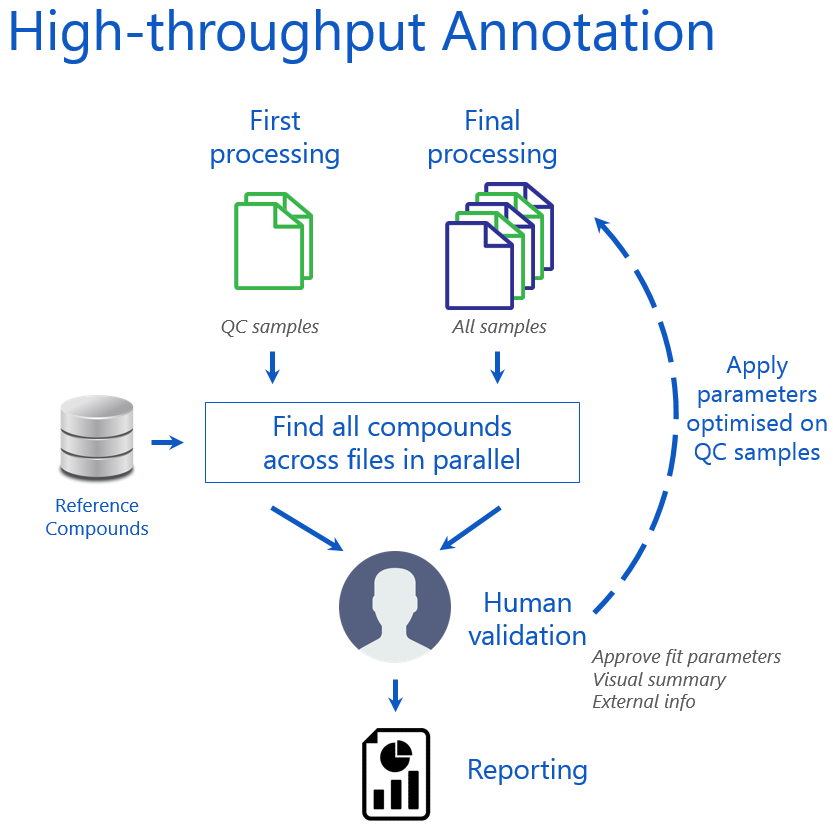
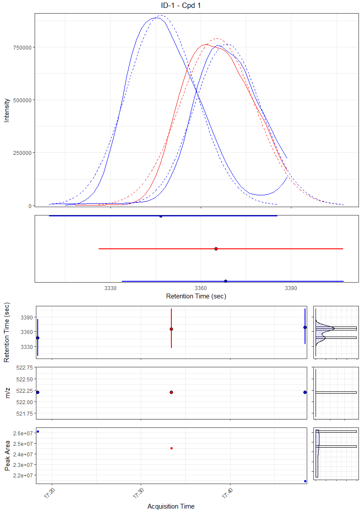

```{r, echo = FALSE}
knitr::opts_chunk$set(
  collapse = TRUE,
  comment = "#>"
)
```

The `peakPantheR` package is designed for the detection, integration and reporting of pre-defined features in MS files.

The **Parallel Annotation** is set to detect and integrate **multiple** compounds in **multiple** files in **parallel** and store results in a **single** object.

Using an example dataset, this vignette will:

* Detail the Parallel Annotation concept
* Apply the Parallel Annotation to an example dataset


## Parallel Annotation Concept

```{r, out.width = "700px", echo = FALSE}

```

Parallel compound integration is set to:

* process **multiple** compounds in **multiple** files in **parallel**, store results in a **single** object
* load list of expected _RT_ / _m/z_ ROI and list of files to process
* initialise output object with expected ROI and file paths
* first pass (_without peak filling_):
    + for each file, detect features in each ROI and keep highest intensity
    + determine peak statistics for each feature
    + store results + EIC for each ROI
* visual inspection of first pass results, update ROI:
    + diagnostic plots: all EICs, peak apex _RT_ / _m/z_ & peak width evolution
    + correct ROI (remove interfering feature, correct _RT_ shift)
    + define fallback integration regions (FIR) if no feature is detected (median _RT_ / _m/z_ start and end of found features)
* initialise new output object, with updated regions of interest (uROI) and fallback integration regions (FIR)
* second pass (_with peak filling_):
    + for each file, detect features in each uROI and keep highest intensity
    + determine peak statistics for each feature
    + integrate FIR when no peaks found
    + store results + EIC for each uROI
* summary statistics:
    + plot EICs, apex and peakwidth evolution
    + compare first and second pass
* return result object and/or table (_row: file, col: compound_)


## Parallel Annotation Example

We can target 2 features in 3 MS spectra file from the _`faahKO`_ package with `peakPantheR_parallelAnnotation()`:


### Input Data

Input spectra are selected:
```{r, echo = FALSE, include = FALSE}
# hide package load message
library(faahKO)
```
```{r}
library(faahKO)
## file paths
input_spectraPaths  <- c(system.file('cdf/KO/ko15.CDF', package = "faahKO"),
                         system.file('cdf/KO/ko16.CDF', package = "faahKO"),
                         system.file('cdf/KO/ko18.CDF', package = "faahKO"))
input_spectraPaths
```


Two targeted features are defined and stored in a table with as columns:

* `cpdID` (numeric)
* `cpdName` (character)
* `rtMin` (sec)
* `rtMax` (sec)
* `rt` (sec, optional / `NA`)
* `mzMin` (m/z)
* `mzMax` (m/z)
* `mz` (m/z, optional / `NA`)

```{r, eval = FALSE}
# targetFeatTable
input_targetFeatTable     <- data.frame(matrix(vector(), 2, 8, dimnames=list(c(), c("cpdID", "cpdName", "rtMin", "rt", "rtMax", "mzMin", "mz", "mzMax"))), stringsAsFactors=F)
input_targetFeatTable[1,] <- c("ID-1", "Cpd 1", 3310., 3344.888, 3390., 522.194778, 522.2, 522.205222)
input_targetFeatTable[2,] <- c("ID-2", "Cpd 2", 3280., 3385.577, 3440., 496.195038, 496.2, 496.204962)
input_targetFeatTable[,c(3:8)] <- sapply(input_targetFeatTable[,c(3:8)], as.numeric)
```
```{r, results = "asis", echo = FALSE}
input_targetFeatTable     <- data.frame(matrix(vector(), 2, 8, dimnames=list(c(), c("cpdID", "cpdName", "rtMin", "rt", "rtMax", "mzMin", "mz", "mzMax"))), stringsAsFactors=F)
input_targetFeatTable[1,] <- c("ID-1", "Cpd 1", 3310., 3344.888, 3390., 522.194778, 522.2, 522.205222)
input_targetFeatTable[2,] <- c("ID-2", "Cpd 2", 3280., 3385.577, 3440., 496.195038, 496.2, 496.204962)
input_targetFeatTable[,c(3:8)] <- sapply(input_targetFeatTable[,c(3:8)], as.numeric)
rownames(input_targetFeatTable) <- NULL
pander::pandoc.table(input_targetFeatTable, digits = 9)
```


Additional compound and spectra metadata can be provided but isn't employed during the fit:

```{r, eval = FALSE}
# spectra Metadata
input_spectraMetadata  <- data.frame(matrix(c("sample type 1", "sample type 2", "sample type 1"), 3, 1, dimnames=list(c(), c("sampleType"))), stringsAsFactors=F)
```
```{r, results = "asis", echo = FALSE}
input_spectraMetadata  <- data.frame(matrix(c("sample type 1", "sample type 2", "sample type 1"), 3, 1, dimnames=list(c(), c("sampleType"))), stringsAsFactors=F)
pander::pandoc.table(input_spectraMetadata)
```


### Initialise and Run Parallel Annotation

A `peakPantheRAnnotation` object is first initialised with the path to the files to process (`spectraPaths`), compounds to integrate (`targetFeatTable`) and additional information and parameters such as `spectraMetadata`, `uROI`, `FIR` and if they should be used (`useUROI=TRUE`, `useFIR=TRUE`):
```{r}
library(peakPantheR)
init_annotation <- peakPantheRAnnotation(spectraPaths = input_spectraPaths,
                                         targetFeatTable = input_targetFeatTable,
                                         spectraMetadata = input_spectraMetadata)
```

The resulting `peakPantheRAnnotation` object is not annotated, does not contain and use `uROI` and `FIR`
```{r}
init_annotation
```

`peakPantheR_parallelAnnotation()` will execute the annotation across files in parallel (if `ncores` >0) and return the successful annotations (`result$annotation`) and failures (`result$failures`):
```{r}
# annotate files serially
annotation_result <- peakPantheR_parallelAnnotation(init_annotation, ncores=0, verbose=TRUE)

# successful fit
nbSamples(annotation_result$annotation)
data_annotation   <- annotation_result$annotation
data_annotation

# list failed fit
annotation_result$failures
```


### Process Parallel Annotation Results

Based on the fit results, updated ROI (`uROI`) and fallback integration region (`FIR`) can be determined using `annotationParamsDiagnostic()`:

* `uROI` are established as the min/max (`rt` and `m/z`) of the found peaks (+/- 5% in RT)
* `FIR` are established as the median of found `rtMin`, `rtMax`, `mzMin`, `mzMax`

```{r}
updated_annotation  <- annotationParamsDiagnostic(data_annotation, verbose=TRUE)

# uROI now exist
updated_annotation
```

`outputAnnotationDiagnostic()` will save to disk `annotationParameters_summary.csv` containing the original `ROI` and newly determined `uROI` and `FIR` for manual validation. Additionnaly a diagnostic plot for each compound is saved for reference:
```{r, eval = FALSE}
# create a colourScale based on the sampleType
uniq_sType <- sort(unique(spectraMetadata(updated_annotation)$sampleType),na.last=TRUE)
col_sType  <- unname( setNames(c('blue', 'red'),c(uniq_sType))[spectraMetadata(updated_annotation)$sampleType] )

# output fit diagnostic to disk
outputAnnotationDiagnostic(updated_annotation, saveFolder='/output_folder/', savePlots=TRUE, sampleColour=col_sType, verbose=TRUE)
```


```{r, results = "asis", echo = FALSE}
tmp_csv      <- data.frame(matrix(nrow=2,ncol=21,dimnames=list(c(), c('cpdID', 'cpdName', 'X', 'ROI_rt', 'ROI_mz','ROI_rtMin', 'ROI_rtMax', 'ROI_mzMin', 'ROI_mzMax', 'X', 'uROI_rtMin', 'uROI_rtMax', 'uROI_mzMin', 'uROI_mzMax', 'uROI_rt', 'uROI_mz', 'X', 'FIR_rtMin', 'FIR_rtMax', 'FIR_mzMin', 'FIR_mzMax'))), stringsAsFactors=FALSE)
tmp_csv[1,]  <- c('ID-1', 'Cpd 1', '|', 3344.888, 522.2, 3310., 3390., 522.194778, 522.205222, '|', 3305.75893, 3411.436284, 522.194778, 522.205222, 3344.888, 522.2, '|', 3326.10635, 3407.272648, 522.194778, 522.205222)
tmp_csv[2,]  <- c('ID-2', 'Cpd 2', '|', 3385.577, 496.2, 3280., 3440., 496.195038, 496.204962, '|', 3337.376665, 3462.449033, 496.195038, 496.204962, 3385.577, 496.2, '|', 3365.023857, 3453.404957, 496.195038, 496.204962)
tmp_csv[,-c(1,2,3,10,17)]  <- sapply(tmp_csv[,-c(1,2,3,10,17)], as.numeric)
colnames(tmp_csv) <- c('cpdID', 'cpdName', 'X', 'ROI_rt', 'ROI_mz','ROI_rtMin', 'ROI_rtMax', 'ROI_mzMin', 'ROI_mzMax', 'X', 'uROI_rtMin', 'uROI_rtMax', 'uROI_mzMin', 'uROI_mzMax', 'uROI_rt', 'uROI_mz', 'X', 'FIR_rtMin', 'FIR_rtMax', 'FIR_mzMin', 'FIR_mzMax')
pander::pandoc.table(tmp_csv, digits=9)
```

```{r, out.width = "700px", echo = FALSE}

```

> Diagnostic plot for compound 1: The top panel is an overlay of the extracted EIC across all samples with the fitted curve as dotted line. The panel under the EIC represent each found peak RT peakwidth (`rtMin`, `rtMax` and apex marked as dot), ordered with the first sample at the top. The bottom 3 panels represent found `RT` (peakwidth), `m/z` (peakwidth) and `peak area` by run order, with the corresponding histograms to the right


`ROI` exported to `.csv` can be updated based on the diagnostic plots; `uROI` (updated ROI potentially used for all samples) and `FIR` (fallback integration regions for when no peak is found) can also be tweaked to better fit the peaks.


### New Initialisation with Updated Parameters to be Applied to All Study Samples

Following this manual validation of the fit on reference samples, the modified parameters in the `.csv` file can be reloaded and applied to all study samples.


#### Load new fit parameters

`peakPantheR_loadAnnotationParamsCSV()` will load the new `.csv` parameters (as generated by `outputAnnotationDiagnostic()`) and initialise a `peakPantheRAnnotation` object without `spectraPaths`, `spectraMetadata` or `cpdMetadata` which will need to be added before annotation. `useUROI` and `useFIR` are set to FALSE and will need to be set accordingly. `uROIExist` is established depending on the uROI columns present in the `.csv` and will only be set to TRUE if no `NA` are present.

```{r, eval = FALSE}
update_csv_path <- '/path_to_new_csv/'

# load csv
new_annotation <- peakPantheR_loadAnnotationParamsCSV(update_csv_path)
#> uROIExist set to TRUE
#> New peakPantheRAnnotation object initialised for 2 compounds

new_annotation
#> An object of class peakPantheRAnnotation
#>  2 compounds in 0 samples. 
#>   updated ROI exist (uROI)
#>   does not use updated ROI (uROI)
#>   does not use fallback integration regions (FIR)
#>   is not annotated
```


#### Add new samples to process

Now that the fit parameters were set on the QC samples, the same processing can be applied to all study samples. `resetAnnotation()` will reinitialise all the results and modify the samples or compounds targeted if required:

```{r}
## new files
new_spectraPaths  <- c(system.file('cdf/KO/ko15.CDF', package = "faahKO"),
                       system.file('cdf/WT/wt15.CDF', package = "faahKO"),
                       system.file('cdf/KO/ko16.CDF', package = "faahKO"),
                       system.file('cdf/WT/wt16.CDF', package = "faahKO"),
                       system.file('cdf/KO/ko18.CDF', package = "faahKO"),
                       system.file('cdf/WT/wt18.CDF', package = "faahKO"))
```
```{r, echo = FALSE}
new_spectraPaths
```


```{r}
## new spectra metadata
new_spectraMetadata  <- data.frame(matrix(c("KO", "WT", "KO", "WT", "KO", "WT"), 6, 1, dimnames=list(c(), c("Group"))), stringsAsFactors=F)
```
```{r, results = "asis", echo = FALSE}
new_spectraMetadata  <- data.frame(matrix(c("KO", "WT", "KO", "WT", "KO", "WT"), 6, 1, dimnames=list(c(), c("Group"))), stringsAsFactors=F)
pander::pandoc.table(new_spectraMetadata)
```

```{r, echo=FALSE}
new_annotation <- resetAnnotation(updated_annotation, spectraPaths=new_spectraPaths, spectraMetadata=new_spectraMetadata, useUROI=TRUE, useFIR=TRUE, verbose=FALSE) 
```

```{r, eval=FALSE}
## add new samples to the annotation loaded from csv, useUROI, useFIR

new_annotation <- resetAnnotation(new_annotation, spectraPaths=new_spectraPaths, spectraMetadata=new_spectraMetadata, useUROI=TRUE, useFIR=TRUE)
#> peakPantheRAnnotation object being reset:
#>   Previous "ROI", "cpdID" and "cpdName" value kept
#>   Previous "uROI" value kept
#>   Previous "FIR" value kept
#>   Previous "cpdMetadata" value kept
#>   New "spectraPaths" value set
#>   New "spectraMetadata" value set
#>   Previous "uROIExist" value kept
#>   New "useUROI" value set
#>   New "useFIR" value set
```
```{r}
new_annotation
```


### Run Final Parallel Annotation

Run the final annotation:
```{r}
# annotate files serially
new_annotation_result <- peakPantheR_parallelAnnotation(new_annotation, ncores=0, verbose=FALSE)

# successful fit
nbSamples(new_annotation_result$annotation)

final_annotation      <- new_annotation_result$annotation
final_annotation

# list failed fit
new_annotation_result$failures
```


#### Output final results

The final fits can be saved to disk with `outputAnnotationDiagnostic()`:
```{r, eval = FALSE}
# create a colourScale based on the sampleType
uniq_group <- sort(unique(spectraMetadata(final_annotation)$Group),na.last=TRUE)
col_group  <- unname( setNames(c('blue', 'red'),c(uniq_sType))[spectraMetadata(final_annotation)$Group] )

# output fit diagnostic to disk
outputAnnotationDiagnostic(final_annotation, saveFolder='/final_output_folder/', savePlots=TRUE, sampleColour=col_group, verbose=TRUE)
```

For each processed sample, a `peakTables` contains all the fit information for all compounds targeted. `annotationTable( , column)` will group the values across all samples and compounds for any `peakTables` column:
```{r, eval=FALSE}
# peakTables for the first sample
peakTables(final_annotation)[[1]]
```
```{r, results = "asis", echo = FALSE}
pander::pandoc.table(peakTables(final_annotation)[[1]])
```
```{r, eval=FALSE}
# Extract the found peak area for all compounds and all samples
annotationTable(final_annotation, column='peakArea')
```
```{r, results = "asis", echo = FALSE}
pander::pandoc.table(annotationTable(final_annotation, column='peakArea'))
```

Finally all annotation results can be saved to disk as `.csv` with `outputAnnotationResult()`. These `.csv` will contain the compound metadata, spectra metadata and a file for each column of peakTables (with samples as rows and compounds as columns):

```{r, eval=FALSE}
# save
outputAnnotationResult(final_annotation, saveFolder='/final_output_folder/', annotationName='ProjectName', verbose=TRUE)
#> Compound metadata saved at /final_output_folder/ProjectName_cpdMetadata.csv
#> Spectra metadata saved at /final_output_folder/ProjectName_spectraMetadata.csv
#> Peak measurement "found" saved at /final_output_folder/ProjectName_found.csv
#> Peak measurement "rtMin" saved at /final_output_folder/ProjectName_rtMin.csv
#> Peak measurement "rt" saved at /final_output_folder/ProjectName_rt.csv
#> Peak measurement "rtMax" saved at /final_output_folder/ProjectName_rtMax.csv
#> Peak measurement "mzMin" saved at /final_output_folder/ProjectName_mzMin.csv
#> Peak measurement "mz" saved at /final_output_folder/ProjectName_mz.csv
#> Peak measurement "mzMax" saved at /final_output_folder/ProjectName_mzMax.csv
#> Peak measurement "peakArea" saved at /final_output_folder/ProjectName_peakArea.csv
#> Peak measurement "maxIntMeasured" saved at /final_output_folder/ProjectName_maxIntMeasured.csv
#> Peak measurement "maxIntPredicted" saved at /final_output_folder/ProjectName_maxIntPredicted.csv
#> Peak measurement "is_filled" saved at /final_output_folder/ProjectName_is_filled.csv
#> Peak measurement "ppm_error" saved at /final_output_folder/ProjectName_ppm_error.csv
#> Peak measurement "rt_dev_sec" saved at /final_output_folder/ProjectName_rt_dev_sec.csv
#> Peak measurement "tailingFactor" saved at /final_output_folder/ProjectName_tailingFactor.csv
#> Peak measurement "asymmetryFactor" saved at /final_output_folder/ProjectName_asymmetryFactor.csv
```

## See Also

* [Getting Started with peakPantheR](getting-started.html)
* [Real Time Annotation](real-time-annotation.html)
