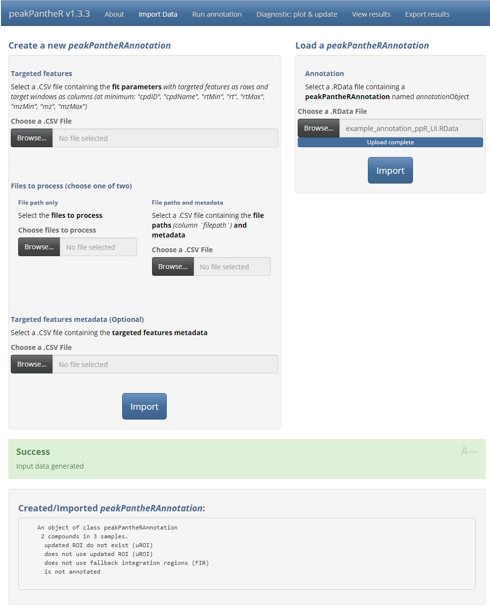
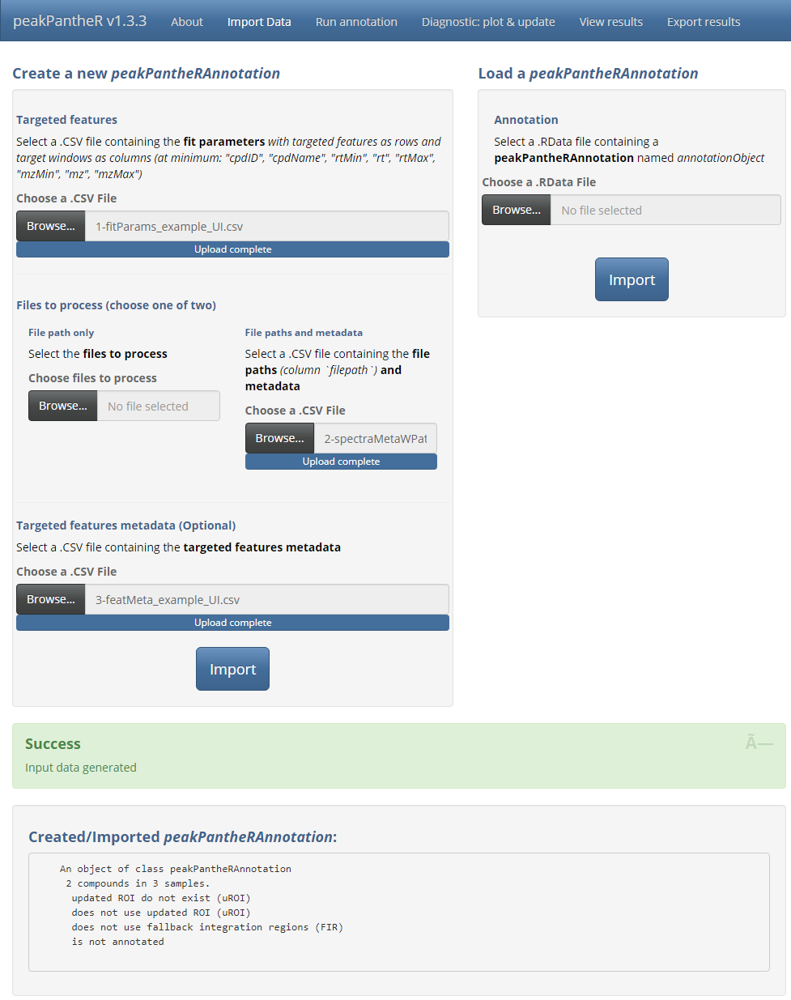
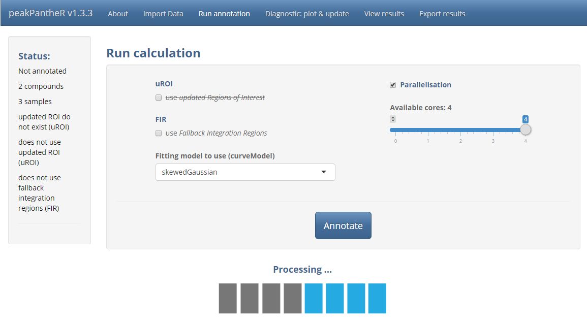
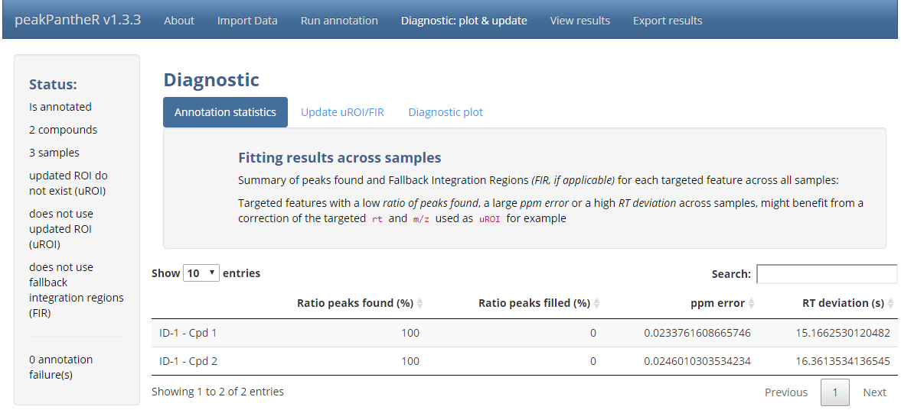
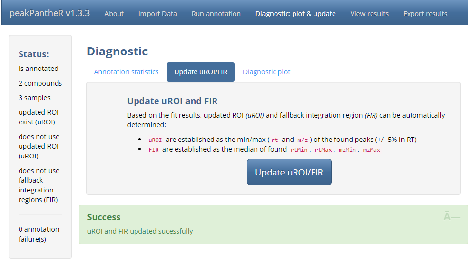
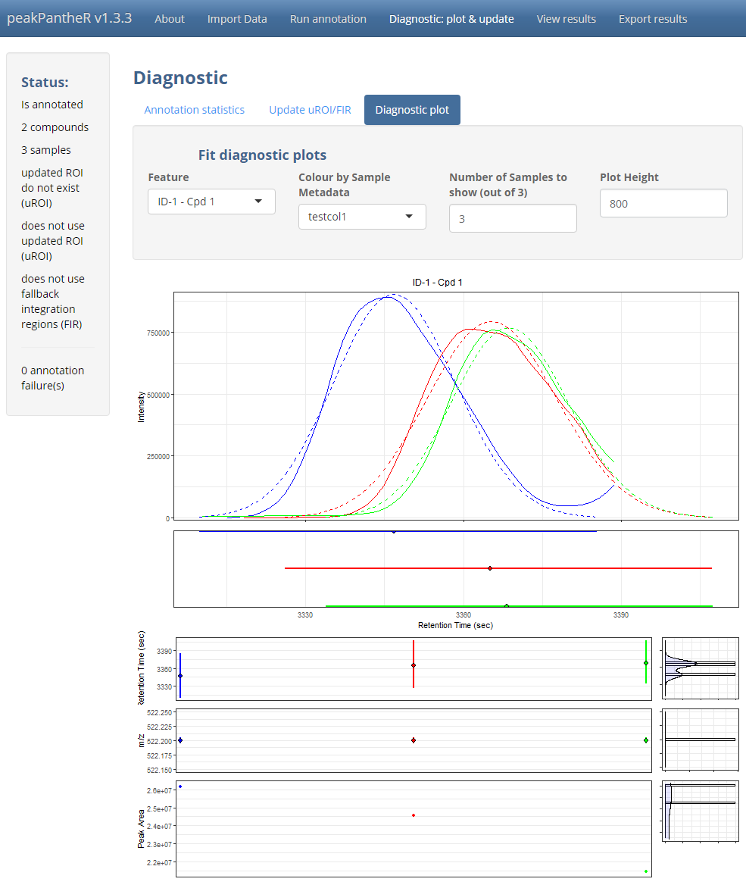
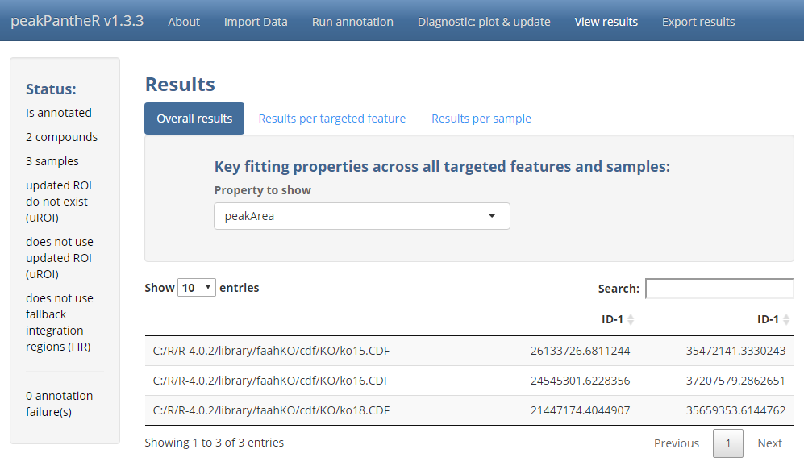
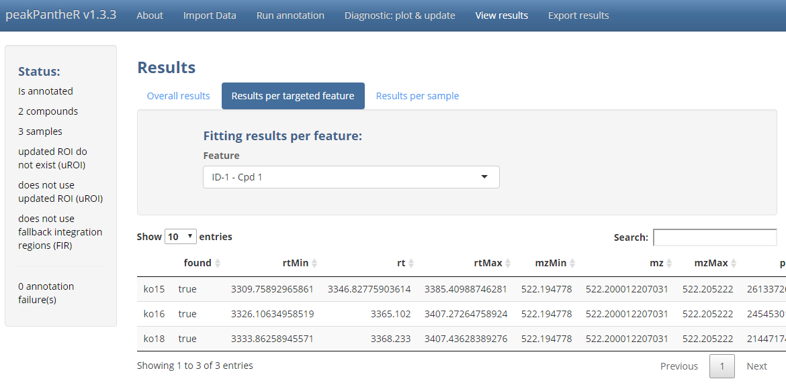
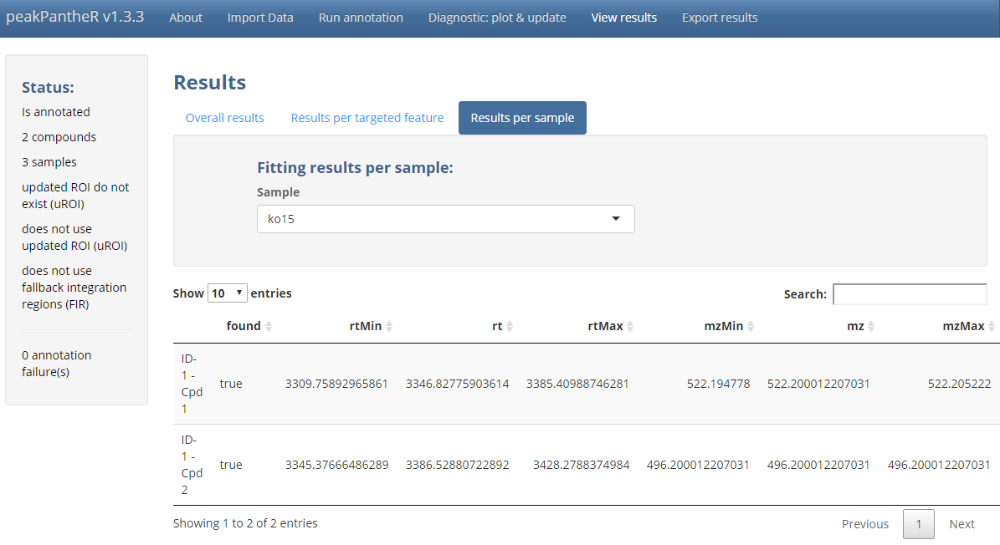
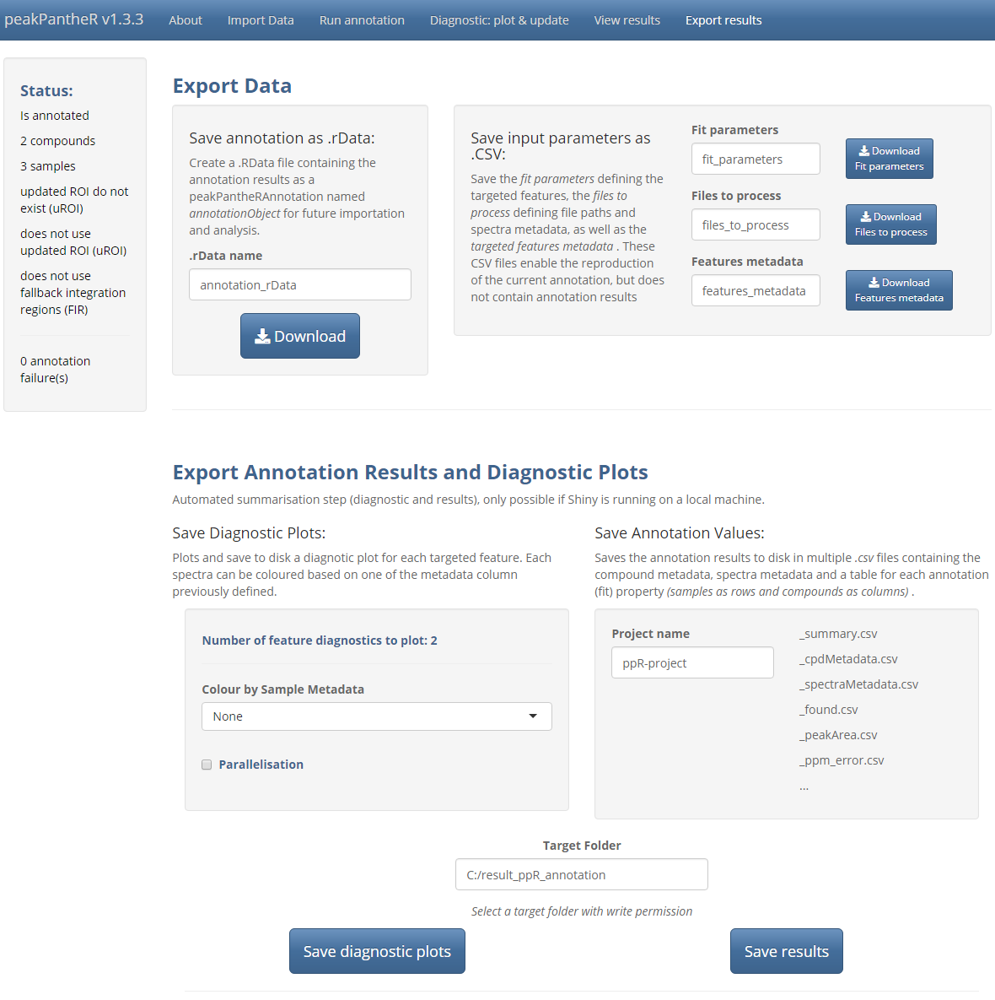

```{r biocstyle, echo = FALSE, results = "asis" }
BiocStyle::markdown()
```
```{r, echo = FALSE}
knitr::opts_chunk$set(
    collapse = TRUE,
    comment = "#>"
)
```

**Package**: `r Biocpkg("peakPantheR")`<br />
**Authors**: Arnaud Wolfer, Goncalo Correia<br />

```{r init, message = FALSE, echo = FALSE, results = "hide" }
## Silently loading all packages
library(BiocStyle)
library(peakPantheR)
library(faahKO)
library(pander)
```

# Introduction

The `peakPantheR` package is designed for the detection, integration and
reporting of pre-defined features in MS files (_e.g. compounds, fragments,
adducts, ..._).

The graphical user interface implements all of `peakPantheR`'s functionalities 
and can be preferred to understand the methodology, select the best parameters 
on a subset of the samples before running the command line, or to visually 
explore results.

Using the `r Biocpkg("faahKO")` raw MS dataset as an example, this vignette
will:

* Detail the step-by-step use of the **graphical user interface**
* Apply the **GUI** to a subset of pre-defined features in the
`r Biocpkg("faahKO")` dataset

## Abbreviations
- **ROI**: _Regions Of Interest_
    * reference _RT_ / _m/z_ windows in which to search for a feature
- **uROI**: _updated Regions Of Interest_
    * modifed ROI adapted to the current dataset which override the reference
    ROI
- **FIR**: _Fallback Integration Regions_
    * _RT_ / _m/z_ window to integrate if no peak is found


## Example Data

This vignette employ the `.csv` or `.RData` files generated from 
`r Biocpkg("faahKO")` in the vignette 
[Getting Started with peakPantheR](getting-started.html).


## Getting Started

The graphical user interface is started as follow:
```{r, eval = FALSE}
library(peakPantheR)

peakPantheR_start_GUI(browser = TRUE)
#  To exit press ESC in the command line
```

> The graphical interface is divided in 5 main tabs, **Import Data**, 
**Run annotation**, **Diagnostic: plot & update**, **View results** and 
**Export results**.

$~$

# Graphical User Interface
## Import

The first input format is using a `.RData` file containing a 
_peakPantheRAnnotation_ named `annotationObject`. This object can be annotated 
or not, for example loading a previously run annotation (_see the **Export** 
section for more details_).

```{r, out.width = "700px", echo = FALSE}

```

$~$

The second input format consists of multiple `.csv` files describing the 
targeted features, spectra to process and corresponding metadata (optional). 
Spectra can also be directly selected on disk.

```{r, out.width = "700px", echo = FALSE}

```

$~$

## Run Annotation

With the targeted features and spectra defined, **Run annotation** handles the 
fitting parameter selection as well as downstream computation.
First the use of updated regions of interest (`uROI`) and fallback integration 
regions (`FIR`) can be selected if available. If `uROI` haven't been previously 
defined, the option will be crossed out.
Secondly the curve fitting model to use can be selected from the interface.
Finally `Parallelisation` enables the selection of the number of CPU cores to 
employ for parallel file access and processing.

```{r, out.width = "700px", echo = FALSE}

```

$~$

## Diagnostic: plot & update

> **Note:**
>
> The targeted regions of interest (`ROI`) should represent a good starting 
point for feature integration, however it might be necessary to refine these 
boundary box to the specific analytical run considered. This ensures a 
successful integration over all the spectra irrespective of potential 
chromatographic equilibration differences or retention time drift.
>
> Updated regions of interest (`uROI`) can be defined and will supplant `ROI`. 
`uROI` can for example be manually defined to "tighten" or correct the `ROI` 
and avoid erroneous integration. Another use of `uROI` is to encompass the 
integration region in each sample throughout the run without targeting any 
excess spectral region that would interfere with the correct analysis.
>
> Fallback integration regions (`FIR`) are defined as spectral regions that will
be integrated (_i.e. integrating the baseline signal_) when no successful 
chromatographic peak could be detected in a sample. `FIR` shouldn't reasonably
stretch further than the minimum and maximum bound (_RT_ / _m/z_) of all found 
peaks across all samples for a given feature: this way no excess signal will be 
considered.

$~$

With all features integrated in all samples, **Diagnostic** provide tools to 
assess the quality of the peak integration and refine integration boundaries by 
setting `uROI` and `FIR` adapted to the

$~$

`Annotation statistics` summarises the success in integrating each targeted 
feature. The `ratio of peaks found (%)`, `ratio of peaks filled (%)` and the 
average `ppm error` and `RT deviation (s)` will highlight a feature that wasn't 
reliably integrated over a large number of samples. Visual evaluation 
(_see below_) and the adjustment of `uROI` or `FIR` might assist in tuning the 
integration of said feature.

```{r, out.width = "700px", echo = FALSE}

```

$~$

`Update uROI/FIR` automatically sets `uROI` and `FIR` for each feature based on
the _RT_ / _m/z_ boundaries of the peaks successfully integrated.

```{r, out.width = "700px", echo = FALSE}

```

$~$

`Diagnostic plot` offer a visualisation of a selected feature across all samples
in order of analysis. This visualisation highlights the fitting of the feature 
in each sample, as well as the change in _RT_ / _m/z_ (of the peak apex) and 
peak area through time. Samples can be automatically coloured based on a 
_sample metadata_ column.

```{r, out.width = "700px", echo = FALSE}

```

$~$

Once `uROI` and `FIR` are successfully set, it is possible to go back to the 
**Run annotation** tab and refit all features in all samples (_Note: this will 
overwrite the current results_).

$~$

## View results

If the features integrations are satisfactory, **View results** regroups all 
the integration results

$~$

`Overall results` displays a fitting property for all targeted features (_as 
columns_) and all spectra (_as rows_).

```{r, out.width = "700px", echo = FALSE}

```

$~$

`Results per targeted feature` displays all fitting properties (_as columns_) 
for all samples (_as rows_) for a selected targeted feature.

```{r, out.width = "700px", echo = FALSE}

```

$~$

`Results per sample` displays all fitting properties (_as columns_) for all 
targeted features (_as rows_) for a selected sample.

```{r, out.width = "700px", echo = FALSE}

```

$~$

## Export

The **Export** tab manages the saving of input parameters, annotation results 
and automated reporting.

The `peakPantheRAnnotation` in it's current state can be saved as a `.RData` 
file which can subsequently be reloaded. The `.csv` files defining the current 
analysis can also be exported to reproduce the current processing.

All diagnostic plots from the `Diagnostic` tab can be automatically saved to 
disk for rapid evaluation. This can be executed in parallel if a large number 
of plots have to be generated.

Finally each fitting property can be saved as a `.csv` file with all samples as 
_rows_ and all targeted features as _columns_. Additionally a _summary_ table 
will present the integration success rate for each targeted feature.

```{r, out.width = "700px", echo = FALSE}

```

$~$

# Final Note

If a very high number of targeted features and samples are to be processed, 
`peakPantheR`'s command line functions are more efficient, as they can be 
integrated in scripts and the reporting automated.

$~$

# See Also

* [Getting Started with peakPantheR](getting-started.html)
* [Real Time Annotation](real-time-annotation.html)
* [Parallel Annotation](parallel-annotation.html)